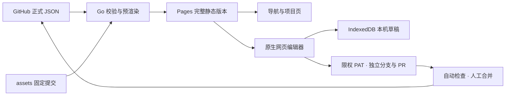

# 架构与边界

本项目是静态发布的个人导航。Go 在构建时解决数据和资源一致性，浏览器承担交互和本机草稿，GitHub 承担权限、版本历史、审查与发布。

## 模块职责

| 位置 | 职责 |
|---|---|
| `cmd/zzp-home/` | build、validate、migrate、icons、check-links、serve 命令 |
| `internal/config/` | 严格配置模型、凭据检查、SunPanel 字段解析与脱敏审计 |
| `internal/sitebuild/` | 固定图标版本、校验下载、96px 图集、HTML 预渲染、资源版本与发布白名单 |
| `data/navigation.json` | 唯一正式导航与共享设置，稳定 ID + 有序数组 |
| `data/projects.json` | 项目说明、预览类型与现有链接 |
| `data/icons.json` | assets 的固定提交、标题、分类、文件大小与 SHA-256；由命令生成 |
| `data/icon-aliases.json` | 一次迁移时的原名称 → assets 路径映射；日常编辑不读取它 |
| `web/shell.html` / `style.css` | 首页 / projects 的静态模板和共同视觉语言 |
| `web/model.js` | 纯数据校验、查询、移动、历史与三方合并 |
| `web/app.js` | 浏览增强、主题、草稿预览、编辑器按需加载与版本提示 |
| `web/editor.js` | 网站 / 分类 / 外观表单、图标选择、Pointer Events 排序与发布界面 |
| `web/storage.js` | 按标签页隔离的 IndexedDB 草稿，序列化事务与存储失败提示 |
| `web/github.js` | 固定仓库 / 固定文件的发布状态机，Token 内存生命周期、文件 SHA 冲突与幂等重试 |
| `web/worker.template` / `recovery.*` | 完整离线版本、完整性修复、安全切换和限定范围的缓存恢复 |
| `tests/` / `scripts/browser-check.cjs` | 纯模型 / API 模拟与实际产物浏览器验证 |

没有插件系统、运行时仓库扫描或外部字体。图标选择器只在编辑时加载索引，按搜索 / 分类分批展示；首页所需图标合成为一张 96px 图集，在 48px 显示尺寸下提供 2 倍像素。原 512px 文件和来源只在 assets 维护，图集随构建再生，不形成另一套原图标准。

## 配置与一致性

schemaVersion 1 的所有字段明确存在。Go 解码拒绝未知字段、null、缺失字段和多余 JSON；浏览器校验同一结构与限制。分类、网站 ID 在整个配置内唯一；顺序由数组表示，没有另一套 sort 数字或关系表。置顶为网站属性，首页置顶视图引用同一记录，不复制数据。

URL 支持 HTTP / HTTPS、普通查询参数和内网 IP；拒绝 userinfo、常见认证参数 / fragment、已知 Token 形态及明显订阅凭据。任意随机路径无法自动证明不是凭据，维护者仍需审查新增链接。导入不会执行数据中的 HTML 或脚本，名称和描述按文本展示。

共享默认主题、布局、密度和描述开关随 GitHub JSON 同步；顶栏主题是本机浏览偏好，可以恢复「共享默认」。网格 / 列表临时浏览切换不写正式配置，编辑器中的默认布局才会跨设备共享。

## GitHub 发布

纯 Pages 无法保密 OAuth client secret；GitHub Web OAuth 换取 Token 的步骤也有 CORS 限制。本版不虚构无需后端的 OAuth 回调。用户每次临时提供 fine-grained PAT，浏览器只向固定 api.github.com 仓库端点发送；先验证实际 push 权限，再读取 main 精确提交上的配置。

文件 SHA 是编辑基线。云端变化时停止写入，按稳定 ID 合并不冲突字段，重叠修改 / 删除与编辑 / 竞争排序明确列出，不采用最后写入覆盖。写入始终在 `nav/edit-<UUID>`，仅修改 data/navigation.json 并创建 PR；main 的规则、必需检查、审批与最终合并全部由 GitHub 执行。

发布进度（无凭据）先持久化再执行远端操作。丢失提交或 PR 响应后，重试读取同一分支内容和已有 PR，不重复生成分支与提交。错误不回显 GitHub 原始响应，以免泄露凭据。

## 缓存与更新

Go 从配置、项目、图标固定索引、网页和构建器源码生成内容版本。页面引用 `r/<版本>/...`，JSON 快照直接嵌入 HTML，导航首次可在 JS 下载前显示。源图下载与用户浏览无关：只在构建时接触 assets，日常访问不依赖 raw GitHub 或 API。

Worker 的清单为每个必需文件保存 SHA-256。安装时并发 6 个请求，全部下载和校验成功才成为候选；缺失或混入其他版本会使安装失败，旧版继续可用。页面与当前资源优先读缓存，缓存损坏 / 缺失时只接受匹配的网络响应；旧页面的版本地址不会替换成新版资源。保留一代旧缓存，限定导航首页、projects、recovery 和版本资源，外部 URL、API 及其他路由不接管。

更新默认等待所有旧标签页关闭，或由用户点击更新。显式更新需所有同范围标签页同意；含未发布编辑的标签页会拒绝。发起页先保存包括尚未应用表单的草稿，再允许切换。批准后短暂冻结交互并重载，恢复流程仍可读取原草稿。IndexedDB 与 Cache Storage 独立，缓存恢复不删除草稿。离线能力以浏览器成功完成缓存且未被系统回收为前提。

## 工程选择

采用 Go 标准库，免除 Node 在生产构建中的必需性；原生 HTML / CSS / JS 已能覆盖 91 个网站和完整编辑器，不需要组件框架、路由库、拖动库或数据库。开发用 Playwright 是唯一 npm 测试依赖。保留项目仓库各自的发布、许可和缓存边界，不建立共同主题 CDN，不迁移其他应用。

[GitHub Pages 自定义工作流](https://docs.github.com/en/pages/getting-started-with-github-pages/using-custom-workflows-with-github-pages) · [GitHub REST 跨域支持](https://docs.github.com/en/rest/using-the-rest-api/using-cors-and-jsonp-to-make-cross-origin-requests) · [OAuth Web 流程](https://docs.github.com/en/apps/oauth-apps/building-oauth-apps/authorizing-oauth-apps#web-application-flow) · [Contents API](https://docs.github.com/en/rest/repos/contents#create-or-update-file-contents)
